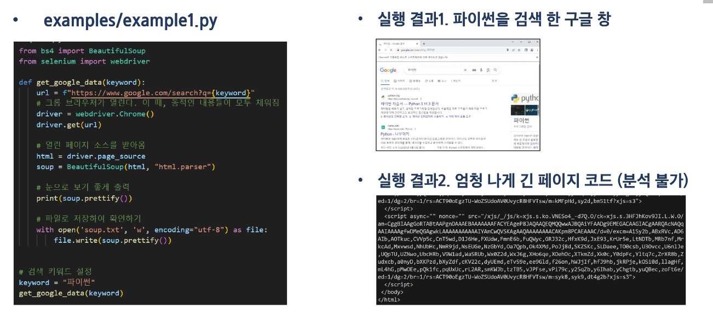
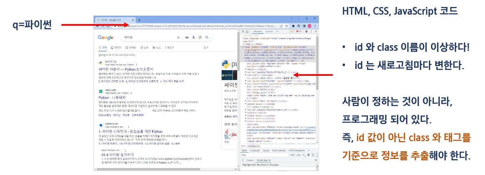
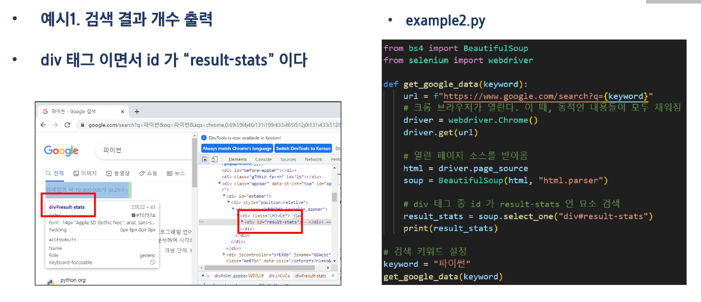
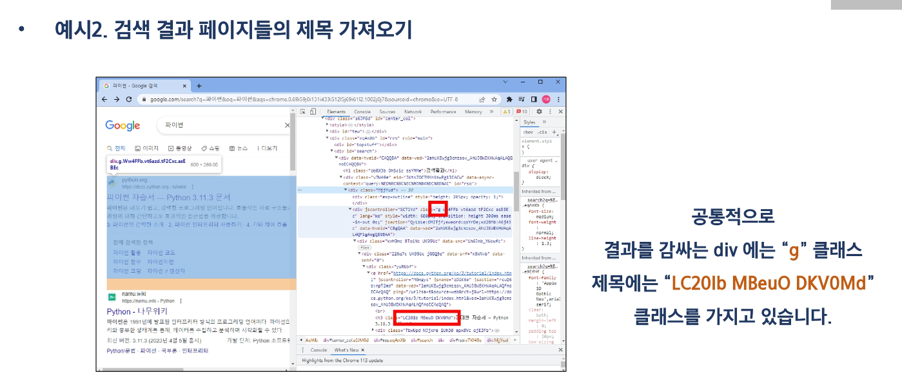
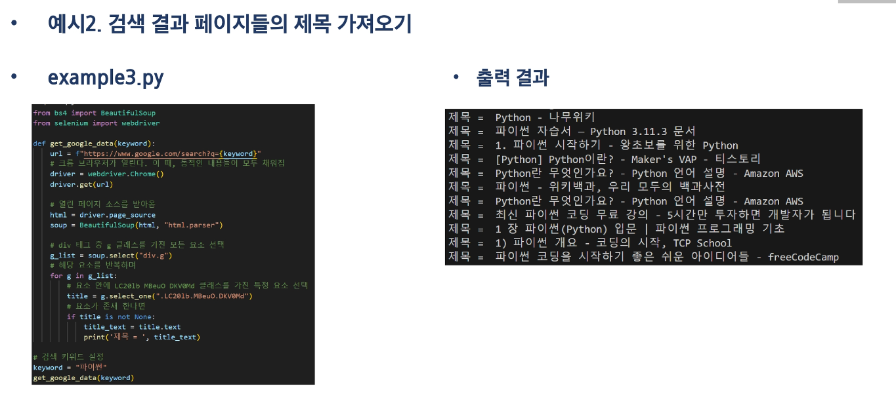

# 05_PJT
# 웹 크롤링 실습
## 데이터 사이언스 프로세스
필요한 정보를 추출하는 5가지 단계
1. 문제 정의 : 해결하고자 하는 문제 정의
2. 데이터 수집 : 문제 해결에 필요한 데이터 수집
3. 데이터 전처리(정제): 실질적인 분석을 수행하기 위해 데이터를 가공하는 단계
    - 수집한 데이터의 오류 제거 (결측치, 이상치), 데이터 형식 변환 등
4. 데이터 분석 : 전처리가 완료된 데이터에서 필요한 정보를 추출하는 단계
5. 결과 해석 및 공유  : 의사 결정에 활용하기 위해 결과를 해석하고 시각화 후 공유하는 단계


## 데이터 수집
- 웹 스크래핑: 웹 페이지에서 데이터를 추출하는 기술
- 웹 크롤링 : 웹 페이지를 자동으로 탐색하고 데이터를 수집하는 기굴
- Open API 활요: 공개된 API를 통해 데이터를 수집
- 데이터 공유 플랫폼 활용 : 다양한 사용자가 데이터를 공유하고 활용할 수 있는 온라인 플랫폼

## 웹 크롤링이란?
- 여러 웹페이지를 돌아다니며 원하는 정보를 모으는 기술
- 원하는 정보를 추출하는 스크래핑과 여러 웹 페이지를 자동으로 탐색하는 크롤링의 개념을 합쳐 웹 크롤링이라고 부름
- 웹사이트들을 돌아다니며 필요한 데이터를 추출하여 활요할 수 있도록 자동화된 프로세스

## 웹 크롤링 프로세스
- 웹 페이지 다운로드
    - 해당 웹 페이지의 HTML, CSS, JavaScript 등의 코드를 가져오는 단계
- 페이지 파싱
    - 다운로드 받은 코드를 분석하고 필요한 데이터를 추출하는 단계
- 링크 추출 및 다른 페이지 탐색
    - 다른 링크를 추출하고, 다음 단계로 이동하여 원하는 데이터를 추출하는 단계
- 데이터 추출 및 저장
    - 분석 및 시각화에 사용하기 위해 데이터를 처리하고 저장하는 단계

## 웹 크롤링 실습
### 준비 단계
필수 라이브러리
- requests : HTTP 요청을 보내고 응답을 받을 수 있는 모듈
- BeautifulSoup: HTTP 문서에서 원하는 데이터를 추출하는 데 사용되는 파이썬 라이브러리
- Selenium: 웹 애플리케이션을 테스트하고 자동화하기 위한 파이썬 라이브러리
    - 앱 페이지의 동적인 컨텐츠를 가져오기 위해 사용함 (검색 결과등)
```python
pip install requests beautifulsoup4 selenium
```

### 기본 예제


구글 검색 결과 분석하기
- F12 혹은 우측클릭-검사 로 크롬 개발자 도구를 열어 활용합니다.








### 참고 BeaytifulSoup4 요소 선택 메서드 종류
1. find()
- 태그를 사용하여 요소를 검색. 첫번째로 일치하는 요소를 반환
2. find_all()
- 태그를 사용하여 요소를 검색. 모든 일치하는 요소를 리스트로 반환
3. select()
- css 선택자를 사용하여 요소를 검색. 모든 일치하는 요소를 리스트로 반환
4. select_one()
- css 선택자를 사용하여 요소를 검색. 첫 번째로 일치하는 요소를 반환
5. find_parent() / find_next_sibling() / find_previous_sibling()
- 태그를 사용하여 요소를 검색. 각각 일치하는 요소의 부모/다음 형제 요소/이전 형제 요소를 반환

