# 08_PJT

# Locust을 활용한 성능 테스트

# 테스트

원하는 기능이 모두 구현되었는지 확인하고, 숨겨져 있는 결함을 찾는 활동

- 여러 가지 도구들을 활요하여 버그를 찾아내고 신뢰성, 보안, 성능 등을 검증하는 중요한 단계
- **상황헤 맞게 필요한 테스트를 진행!**
  - 외우지 말고 검색 통해 필요한 것만 찾아서 ~~

## 성능 테스트

특정 상황에서 시스템이 어느 정도 수준을 보이는가 혹은 어떻게 대처를 하는가를 테스트하는 과정

- 목적

1. 여러 테스트를 통해 **성능 정하가 발생하는 요인을 발견하고 제거**
2. 시장에 출시되기 전에 발생할 수 있는 위험과 개선사항을 파악
3. 안정적이고신뢰할 수 있는 제품을 빠르게 만들기 위함

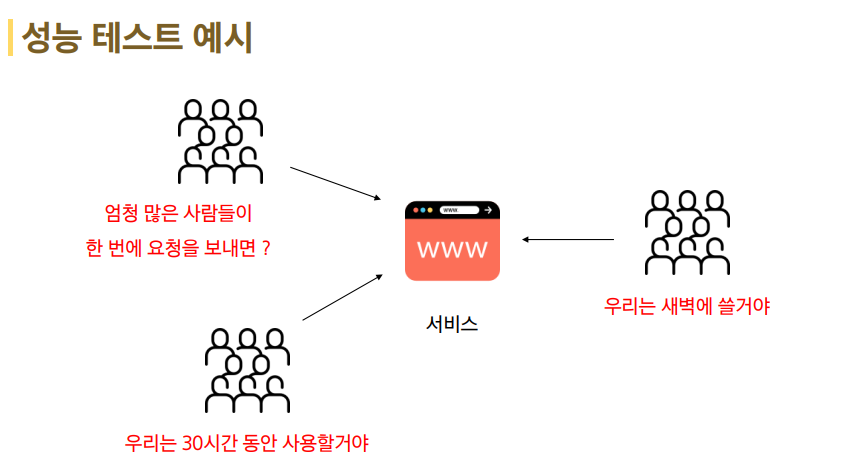

### 부하 테스트

- 시스템의 신뢰도와 성능을 측정
- 시스템에 임계점의 부하가 계속될 때 문제가 없는가?

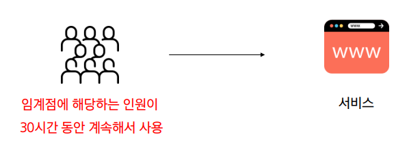

### 스트레스 테스트(Stress Testing)

- 장애 조치와 복구 절차가 효과적이고 효율적인지 확인
- 시스템에 과부하가 오면 어떻게 동작할까?

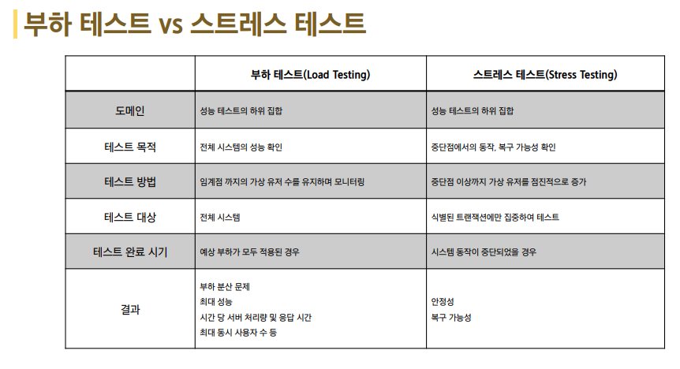

# API 성능 테스트

## Locust

오픈 소스 부하 테스트 도구

- 내가 만든 서버에 수많은 사용자들이 동시에 들어올 때 어떤 일이 벌어지는 지를 확인하는 부하테스트를 할 수 있는 도구
- 파이썬 언어로 테스트 시나리오를 간편하게 작성 가능
- 결과를 웹에서 확인할 수 있는 UI를 지원

### Locust 사용법

1. 테스트 스크립트 작성하기

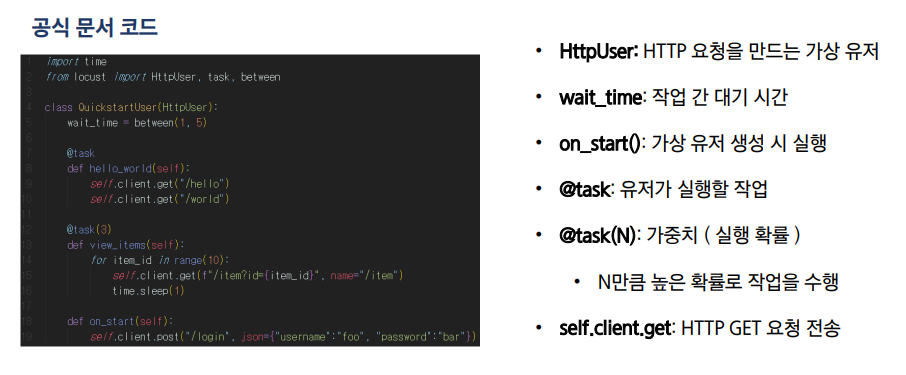

2. Django 서버 실행 Django API 서버를 실행합니다.

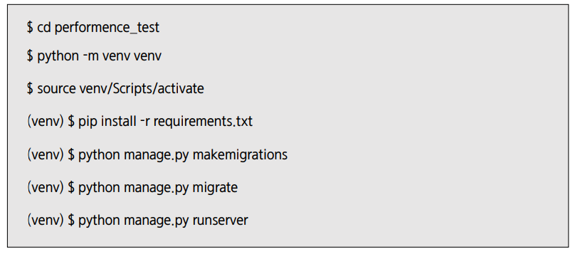

3. vscode 터미널 추가 & Locust 설치 및 실행

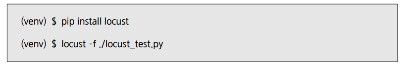

4. Locust 정상 실행 시 터미널에 아래와 같이 접속할 수 있는 URL이 출력됩니다.

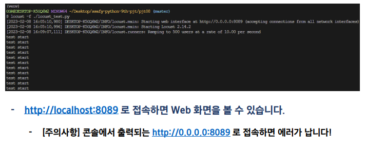

5. 웹 실행 화면 [사이트](http://localhost:8089/)

- 생성할 총 가상 유저 수
- 동시에 접속하는 유저 수
- 서버 주소 (Django 서버)

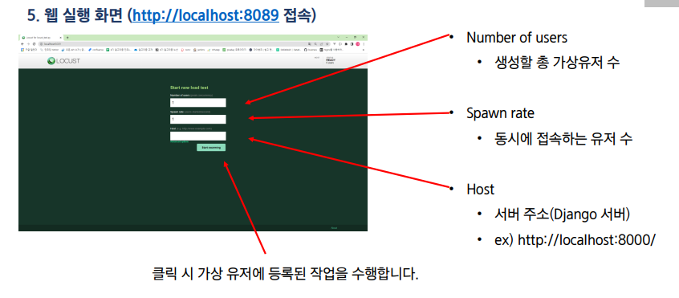

6. 웹 실행화면 - Statistics 탭

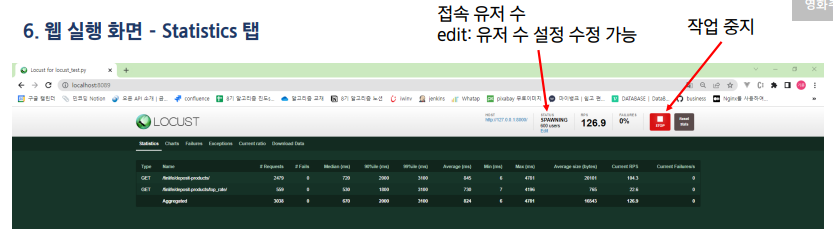

- 각 URL 에 대한 **요청 수, 실패 수, 각 기준에 대한 응답 시간, 평균 응답 크기, RPS** 등 다양한 통계 내용을 확인할 수 있습니다.
- 전체 분석은 터미널에서 터미널 종료(Ctrl + c) 입력 또는 Download Data 탭의 Dowonload Report 클릭 시 확인할 수 있습니다.

7. 웹 실행 화면 - Charts

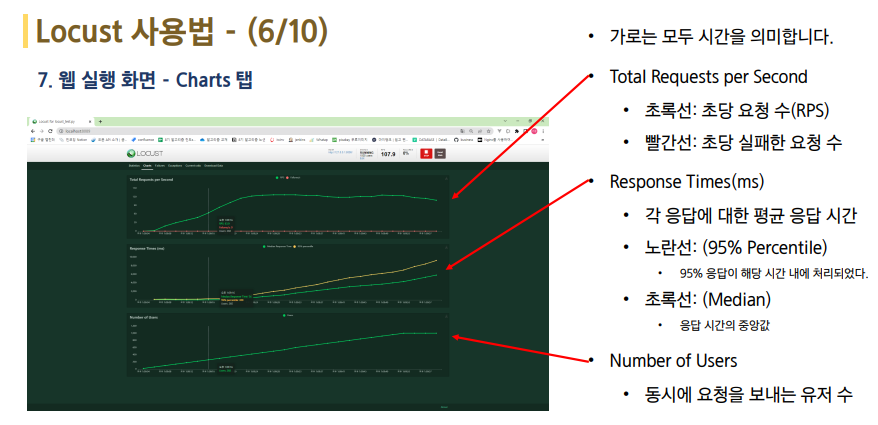

8. 웹 실행 화면 - Failures 탭

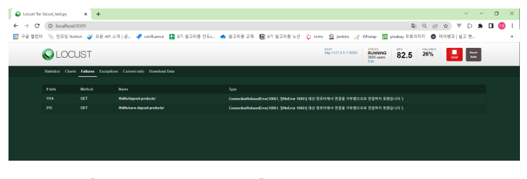

- 실패한 요청에 대한 정보와 실패 원인이 추력됩니다.
  - ex) 대상 컴퓨터에서 연결을 거부했으므로 연결하지 못했습니다.

9. 웹 실행화면

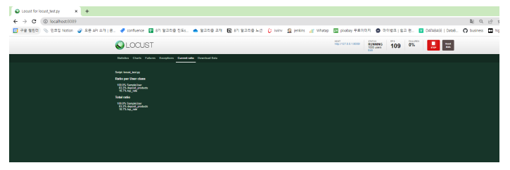

- 현재 작업이 수행된 비울 출력

10. 웹 실행 화면 - 결과화면 (Download Data -> Download Repoert)

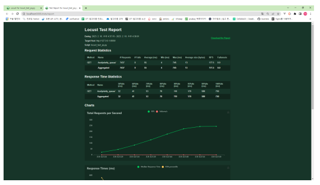

11. 콘솔 종료 화면

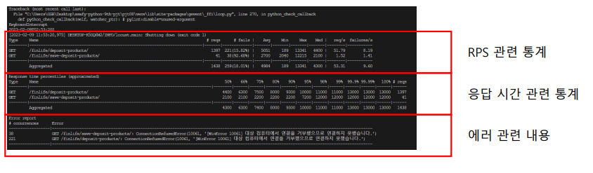

- 콘솔에서 Locust 종료 (Ctrl + c)
  - 위와 같이 전체 요청에 대한 분석은 콘솔에서 확인 가능 !

# 정렬 알고리즘 테스트

## 테스트 주의 사항

- 오늘 테스트는 정석적인 방법과는 좀 다름 ~~
- 정석 : **서버에 배포된 API 또는 프로그램에 부하 테스트를 해야 한다!**
- 현재는 PC에서 작동 중인 서버로 요청 -> PC의 성능에 따라 결과가 매우 달라짐

### 정렬 알고리즘 구현하기

1. 파이썬 내장 정렬 함수 - O(N logN)
2. 버블 정렬 - O(n^2)
3. 우선 순위 큐 - 삽입: O(logN), 삭제 : O(logN)

- 시나리오 1. 랜텀 배열 크기 1000, 랜덤 범위 5000의 배열을 만들어 가장 큰 값 찾기
- 시나리오 2. (10배) 랜텀 배열 크기 10000, 랜덤 범위 50000의 배열을 만들어 가장 큰 값 찾기

1. 사전 준비

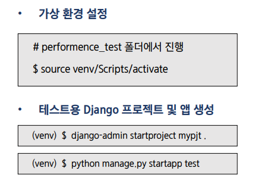

2. 각 정렬 알고리즘에 요청을 보낼 수 있도록 코드 작성

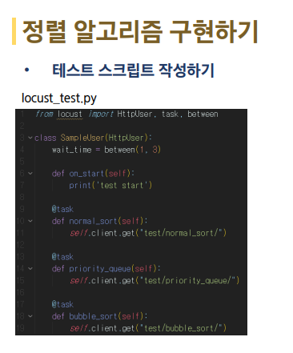

3. 테스트 시나리오 작성하기

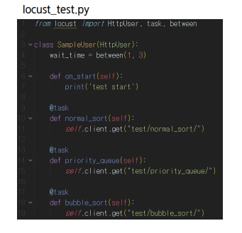

1. 모든 Tsak를 주석 처리한다.
   - task를 하나씩만 주석을 풀어 활성화 시킴
2. Locust를 실행
3. 결과를 웹에서 확인한다.
4. 테스트가 끝난 task를 주석처리 후 다음에 테스트 할 task 주석을 풀어 활성화 시켜줍니다.
5. 위 과정을 반복하면 결과를 확인합니다.

### 시나리오 1

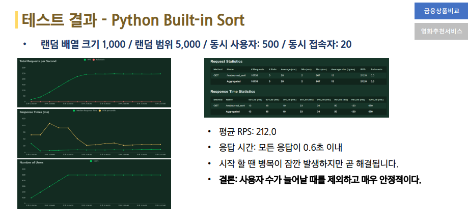  
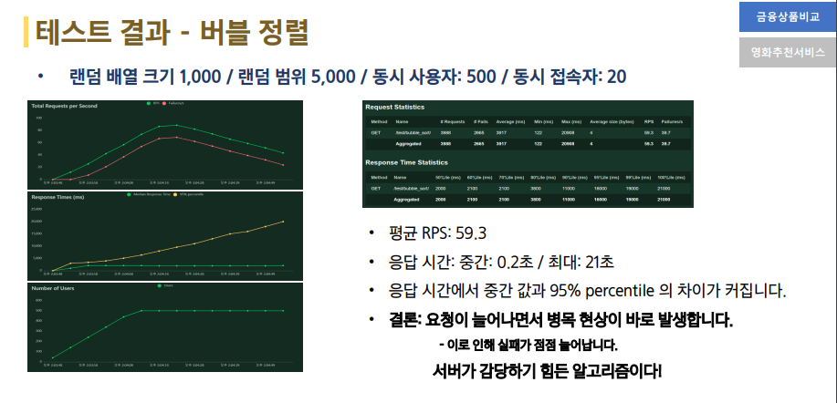  
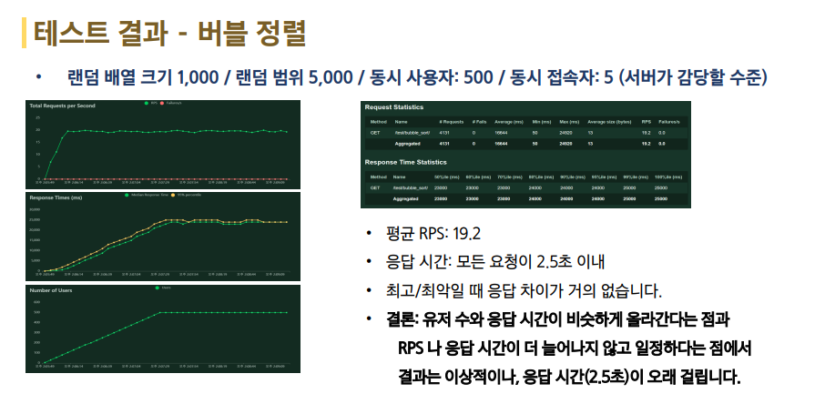  
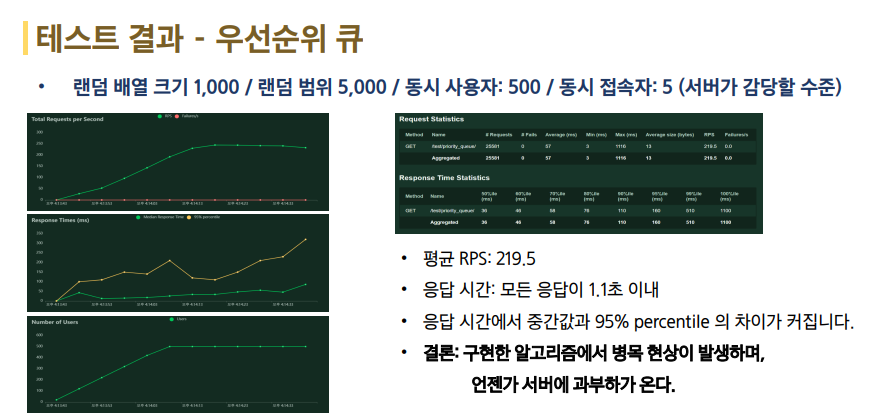

### 시나리오 2

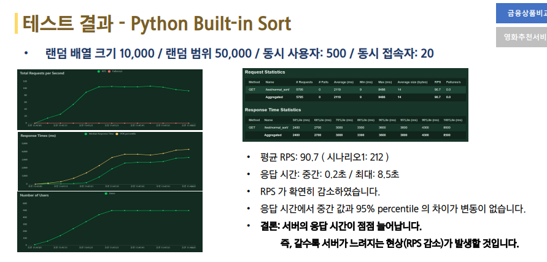  
  
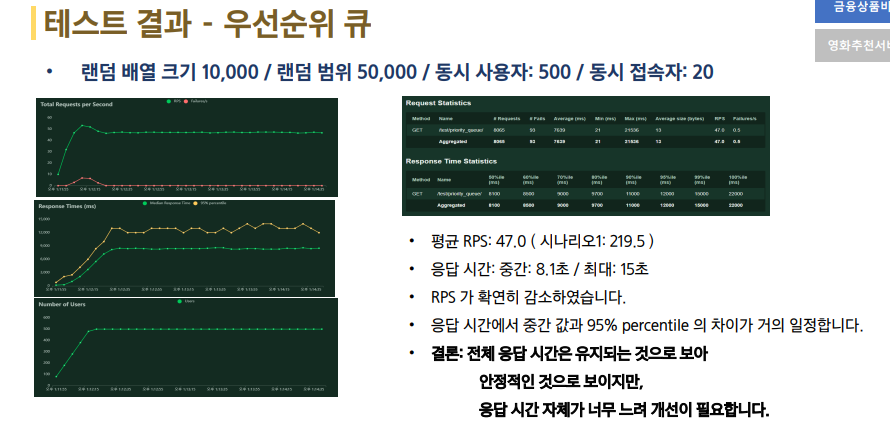

# 결론

- 직접 구현한 우선순위 큐보다 파이썬의 내장 함수가 안정적이고 빠릅니다.
  - 병목 현상이 발생하지 않음
  - 응답 시간이 최고/최악 모두 빠르다
- 알고리즘에 따라 서버 성능이 크게 좌우 될 수 있다!
- 테스트 결과가 보여주는 내용은 작성한 결론 외에도 수 많은 정보를 내포하고 있습니다,
